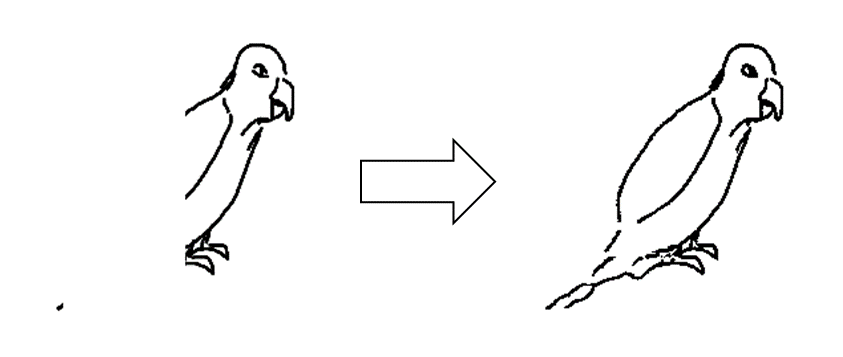
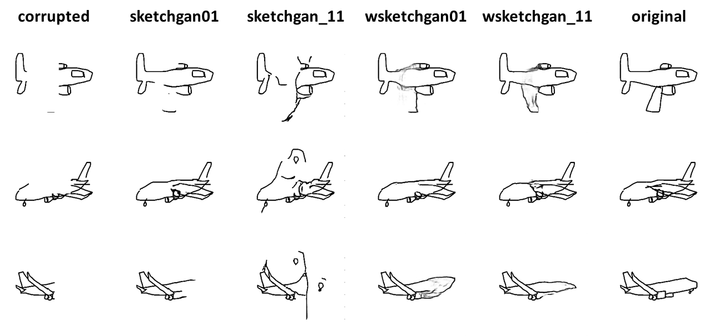
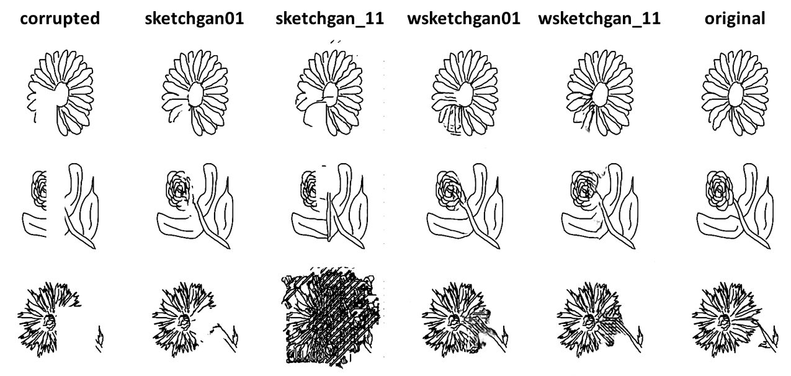
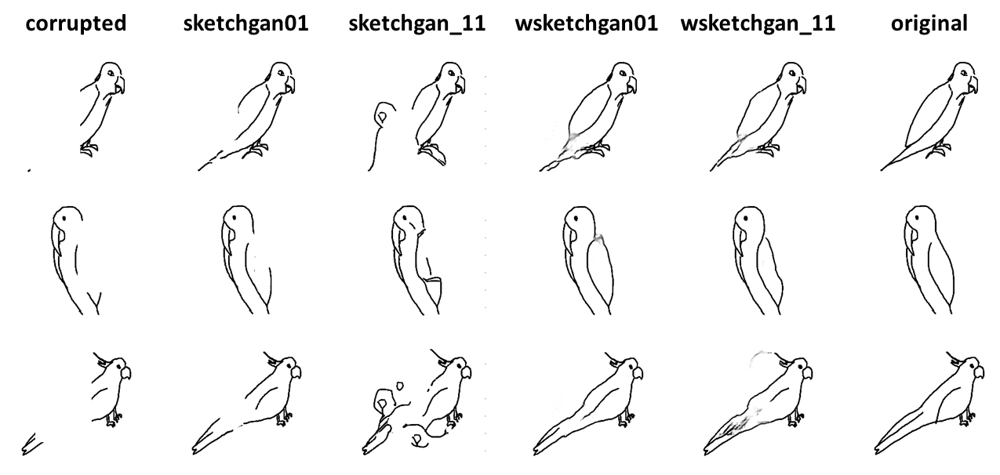
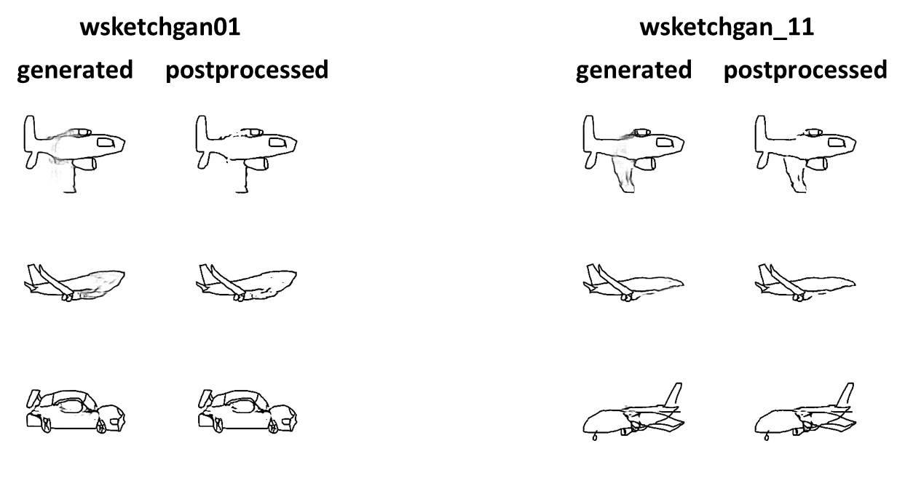
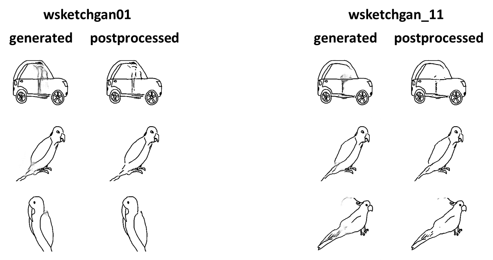

# Sketch Completion With Generative Adversarial Networks

This project tackles the task of **sketch completion**, where incomplete sketches are automatically reconstructed while preserving the original style and structural consistency.
The architecture is inspired by [Liu et al.’s SketchGAN](https://openaccess.thecvf.com/content_CVPR_2019/papers/Liu_SketchGAN_Joint_Sketch_Completion_and_Recognition_With_Generative_Adversarial_Network_CVPR_2019_paper.pdf), and the work explores whether [Wasserstein-based GAN training](https://arxiv.org/pdf/1704.00028) can improve performance for this specific task.

Additionally, a **postprocessing pipeline** is implemented to enhance visual quality, reduce noise, and sharpen contours.

The model can be used for AI-assisted creative tools, digital art restoration, and sketch-based image generation.

## Architecture

The project uses the generator and discriminator proposed by [Liu et al.’s SketchGAN](https://openaccess.thecvf.com/content_CVPR_2019/papers/Liu_SketchGAN_Joint_Sketch_Completion_and_Recognition_With_Generative_Adversarial_Network_CVPR_2019_paper.pdf), alongside an auxiliary classifier based on [ResNet-18](https://arxiv.org/abs/1512.03385) and a critic inspired by the global discriminator from the original SketchGAN architecture.  
The critic was adapted to meet the requirements of the [Wasserstein GAN](https://arxiv.org/pdf/1704.00028), including modifications such as replacing Batch Normalization with Instance Normalization, switching from ReLU to LeakyReLU activations, and removing the final activation to allow unbounded scalar outputs.

## Dataset

The project uses the [Sketchy](http://sketchy.eye.gatech.edu/) dataset, a large-scale collection of **75,471** hand-drawn sketches across **125** object categories. For training stability, sketches labeled as *Error* or *Ambiguous* were removed, leaving **68,320** cleaned sketches.

To simulate incomplete sketches for the completion task, random white rectangular masks were applied, removing **10–40%** of each sketch. The dataset is split **80%/20%** for training and testing.

## Training

The model was trained on the cleaned and augmented **Sketchy** dataset (256×256 images, batch size 16) using two adversarial setups:

### 1. SketchGAN (Adversarial + L1 + Classification)

* **Losses**:

  * Adversarial (BCE)
  * L1 reconstruction (\$\lambda\_1 = 100\$)
  * Auxiliary classification (\$\lambda\_2 = 0.5\$)
* **Optimizer**: Adam, lr=0.0002, β₁=0.5, β₂=0.999
* **Training scheme**: 1 generator update per discriminator update

This setup follows Liu et al.’s SketchGAN as the **baseline**.

### 2. WGAN-GP (Wasserstein Loss + Gradient Penalty)

* **Loss**: Wasserstein loss with gradient penalty (\$\lambda\_{gp} = 10\$)
* **Optimizer**: Adam, lr=0.0001, β₁=0.0, β₂=0.9
* **Training scheme**: 5 critic updates per generator update

Focuses on **training stability** and improved convergence.

### 3. Auxiliary Classifier (ResNet-18)

* Trained independently with **Cross-Entropy Loss** on Sketchy
* Augmentations: random crop (224×224), horizontal flip, random affine (±32 px)
* **Optimizer**: Adam, lr=0.0001, β₁=0.9, β₂=0.999

After convergence, it was integrated into the generator’s loss to guide semantic consistency.

## Postprocessing

Generated sketches are refined to reduce noise and sharpen contours:

* **Bilateral Filtering**: smooths homogeneous regions while preserving edges (parameters: \$d=7\$, \$\sigma\_{color}=\sigma\_{space}=125\$).
* **Adaptive Gaussian Binarization**: converts the filtered image to a clean binary sketch using OpenCV’s **ADAPTIVE\_THRESH\_GAUSSIAN\_C**, robust to uneven shading and reconstruction artifacts.

## Results

### Binary Mask Construction

To measure performance, we used **binary masks**:

* `mask_gt`: pixels removed in the corrupted input.
* `mask_pred`: pixels modified by the generator.
* `active_mask`: union of the two, ensuring fair evaluation.

The active_mask was used to compute **Precision, Recall, F1-score, and Accuracy** — but since such metrics only reflect **pixel alignment**, they don’t always match how realistic the sketches look.

### Quantitative vs. Qualitative

Numerical scores give a baseline, but **visual inspection is the key indicator** of quality. Slight pixel mismatches can lower metrics, even when the result looks correct to the human eye.

### Model Codes

| Code           | Description                                     |
| -------------- | ----------------------------------------------- |
| sketchgan01    | GAN + L1 + classification loss, output \[0, 1]  |
| sketchgan\_11  | GAN + L1 + classification loss, output \[−1, 1] |
| wsketchgan01   | WGAN-GP loss, output \[0, 1]                    |
| wsketchgan\_11 | WGAN-GP loss, output \[−1, 1]                   |

## Visual Results

## Postprocessing Impact

Postprocessing steps improved **edge sharpness** and **removed background noise**, making the completions cleaner and more coherent.

